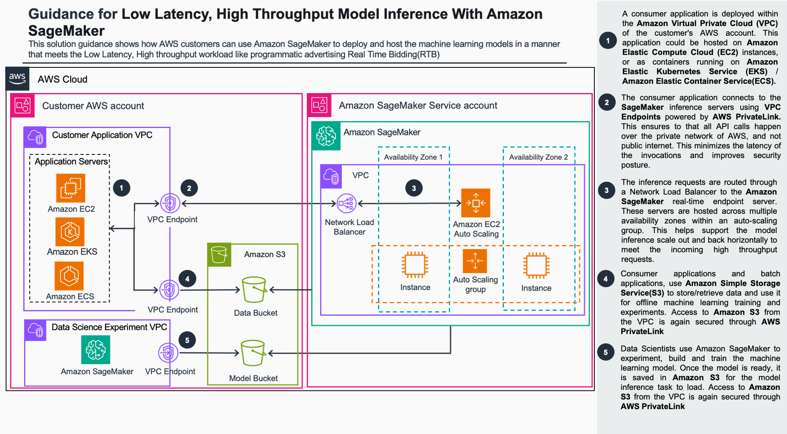

# Guidance for Low Latency High Throughput Model Inference using Amazon SageMaker

## Table of Content

1. [Overview](#overview)
    - [Contents](#contents)
    - [Architecture Overview](#architecture-overview)
    - [Cost](#cost)
2. [Prerequisites](#prerequisites)
    - [Operating System](#operating-system)
3. [Deployment Steps](#deployment-steps)
4. [Deployment Validation](#deployment-validation)
5. [Running the Guidance](#running-the-guidance)
7. [Cleanup](#cleanup)
9. [Revisions](#revisions)
10. [Notices](#notices)
11. [Authors](#authors)

## Overview

### Contents

Quickly deploy a solution for Low latency, high throughput model inference for real-time bidding for Advertising Technology on AWS. Once deployed, you will access an AI/ML environment powered by Amazon SageMaker ([SageMaker](https://aws.amazon.com/sagemaker/)). You will use this environment to access Jupyter-style notebook containing the code that:

* Deploys a sample RTB model on a SageMaker Real-time endpoint
* Uses SageMaker Inference Recommender capabilities to stess test the model on various compute instances to get benchmarks on latency, cost and projected number of model invocations.

### Architecture Overview



### Cost

_You are responsible for the cost of the AWS services used while running this Guidance. As of March 2024, the cost for running this Guidance with the default settings in US East (N. Virginia) is approximately $165.60 per month for a single SageMaker real-time endpoint hosted on an ml.m5.xlarge instance running continuously._

_You are also responsible for the cost of ML instances hosting Jupyter notebooks. Cost for an ml.t3.medium instance as of March 2024 in US East (N. Virginia) is $36 per month._

You will also incur costs related to storage of objects created by Jupyter notebooks in S3 and EFS filesystem create by the SageMaker domain.

Refer to the pricing webpage for each AWS service used in this Guidance.

We recommend creating a [budget](https://alpha-docs-aws.amazon.com/awsaccountbilling/latest/aboutv2/budgets-create.html) through [AWS Cost Explorer](http://aws.amazon.com/aws-cost-management/aws-cost-explorer/) to help manage costs. Prices are subject to change. For full details, refer
to the pricing webpage for each AWS service used in this Guidance.

## Prerequisites

No Amazon SageMaker Domain in your Account is required as the Kit installs a new domain. You can have several domains per account and region.

### Operating System
 
This guidance can be deployed from any Windows, macOS, or Linux environment with an internet connection.

## Deployment Steps

1. The solution uses AWS CloudFormation ([CloudFormation](https://aws.amazon.com/cloudformation/)) to create a new SageMaker Domain. To create the domain you need to upload a ready-to-use CloudFormation template `SageMakerTeamplate.yaml` using the AWS Console or AWS CLI. 


1. Clone this repository to your development desktop
```
git clone git@github.com:aws-solutions-library-samples/guidance-for-low-latency-high-throughput-model-inference-using-amazon-sage-maker.git
```
2. Access AWS Console and navigate to CloudFormation. Choose **Create Stack** button with **With new resources (standard)**  option.

3. Choose `Template is ready`,  `Upload a template file` and select `SageMakerTeamplate.yaml`.

4. Specify `Stack Name` (i.e. SageMaker-Domain) and optionally change the default username under `UserProfileName`.

5. Choose **Next**, **Next**,  acknowledge that AWS CloudFormation might create IAM resources with custom names, then create the Stack.

(Optional) you can use the AWS CLI to deploy the CloudFormation stack as below (replace {userprofile} with your user profile name, i.e. "SageMaker-User-1"):
```
aws cloudformation create-stack --stack-name SageMaker-Domain --template-body file://deployment/SageMakerTeamplate.yaml --capabilities "CAPABILITY_NAMED_IAM" --parameters ParameterKey="UserProfileName",ParameterValue={userprofile}
```
6. Wait until the CloudFormation template completes deployment.

## Deployment Validation

* Open CloudFormation console and verify the status of the template with the name you defined in the previous section.
* If deployment is successful, you should see your stack in the `CREATE_COMPLETE` state.

* Access SageMaker by navigating in AWS Console to the **SageMaker** service and from **Domains** menu on the left, select the **StudioDomain**. 
* Ensure domain with the name you specified as a CloudFormation `Stack Name` (i.e. SageMaker-Domain) is deployed and shows status `InService`.

## Running the Guidance

1. Access the SageMaker Service by navigating in AWS Console to the **SageMaker** service.

2. From the **Domains** menu on the left, select the **StudioDomain** and then **Launch** (button), **Studio** (dropdown)  for the `DefaultUser` (or the username you chose in the CloudFormation template).

3. From the `Applications` menu in the SageMaker Studio, choose **Studio Classic** and then **Open**.

4. In the JupyterLab interface choose the menu items **File**, **New**, **Terminal**. In the opened terminal clone this Git Repository
```
git clone git@github.com:aws-solutions-library-samples/guidance-for-low-latency-high-throughput-model-inference-using-amazon-sage-maker.git
```
You can open Jupyter Notebooks in SageMaker by navigating to **File Browser** (Ctrl + Shift + F) from the vertical ribbon and navigating to the `source` folder.

When prompted choose defaults: `Image` - Data Science 3.0, `Kernel` - Python 3, `Instance type` - ml.t3.medium, `Start-up script` - No script.

Follow the instructions in the Implementation Guide under `/implementation_guide`. You can find code execution instructions under the **Walkthrough of the SageMaker deployment code for inference** section of the guide. We also recommend reviewing other sections of the guide which discuss the use case and solution design considerations.

## Cleanup

When you’re finished experimenting with this solution, clean up your resources by deleting the CloudFormation stack using the AWS Console.

**Known issues**

The stack will fail to fully delete all the resources as the SageMaker Domain deploys an [EFS Filesystem](https://aws.amazon.com/efs/) and uses the VPC and Subnets created in this guidance to deploy Network Interfaces for EFS.

To clean-up, you can manually delete the EFS (if not needed any longer), and then delete the subnets and the VPC created in this guidance.

Additionally, make sure to delete all SageMaker real-time endpoints created by this guidance. You can do so by accessing **SageMaker** service in AWS Console and then navigating to **Inference** and then selecting **Endpoints**. You can delete the endpoints by selecting them one-by-one and choosing **Actions** **Delete**.

You must manually delete the S3 bucket created by SageMaker, typically named as sagemaker-[region]-[account number]]. Implementations do not automatically delete these resources in case you have stored data in them that you need to retain.

## Revisions

1.0 - March 2024

## Notices

*Customers are responsible for making their own independent assessment of the information in this Guidance. This Guidance: (a) is for informational purposes only, (b) represents AWS current product offerings and practices, which are subject to change without notice, and (c) does not create any commitments or assurances from AWS and its affiliates, suppliers or licensors. AWS products or services are provided “as is” without warranties, representations, or conditions of any kind, whether express or implied. AWS responsibilities and liabilities to its customers are controlled by AWS agreements, and this Guidance is not part of, nor does it modify, any agreement between AWS and its customers.*

## Authors

Sovik Nath, Punit Shah, Ram Vegiraju, Ranjith Krishnamoorthy, Steven Alyekhin
